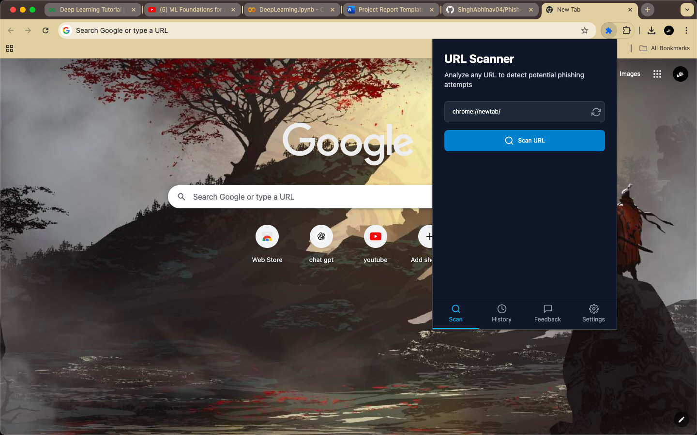
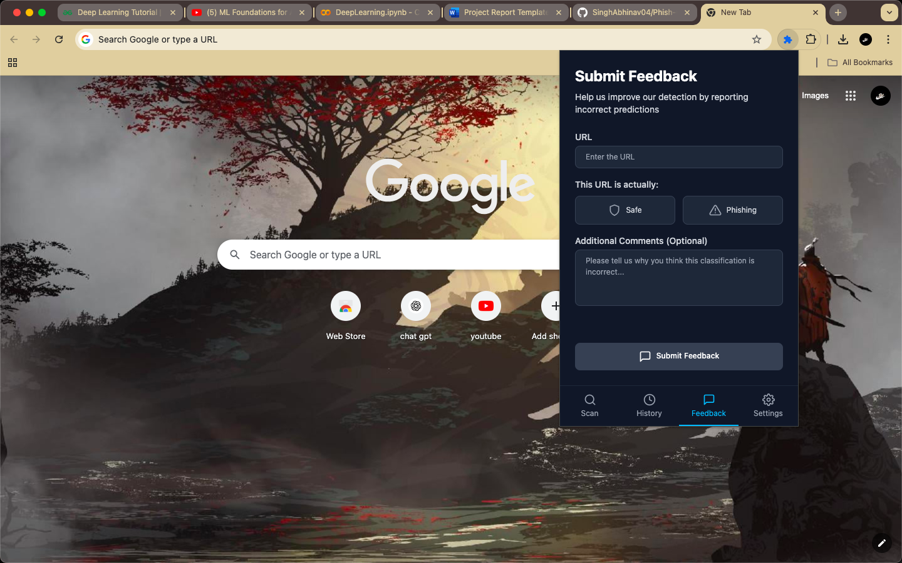
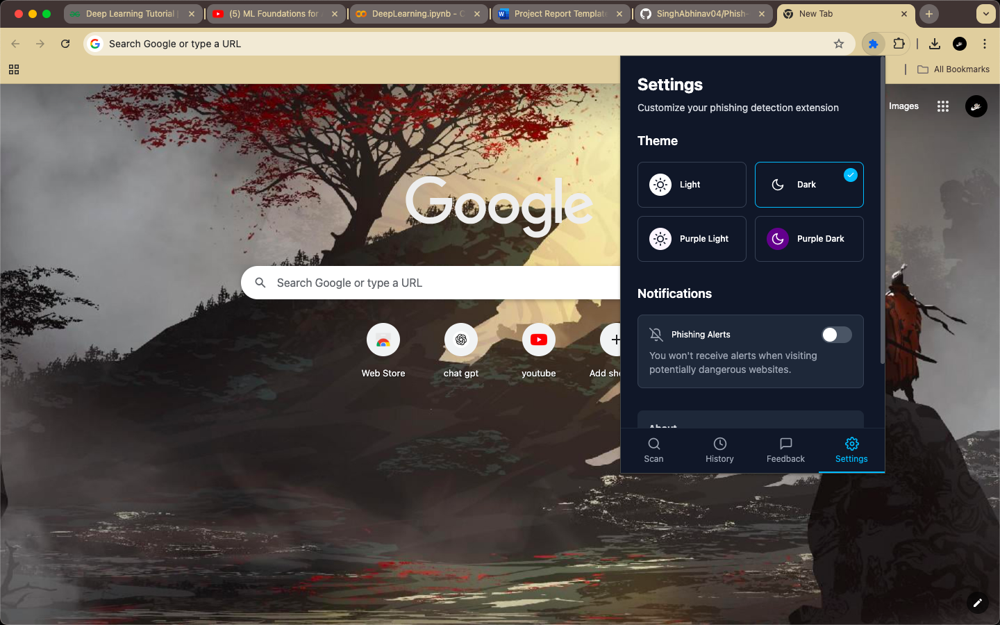

# Frontend for Phishing Detection Web Extension

This directory contains the React-based frontend for the Phishing Detection web extension. The UI provides an intuitive interface for URL scanning, history tracking, feedback submission, and settings management.

##  User Interface

The frontend is designed with a modern, responsive interface built using:

- **React**: UI library for component-based development
- **Framer Motion**: For smooth animations and transitions
- **Context API**: For state management (theme, user preferences)
- **Responsive Design**: Works across various screen sizes







##  Component Structure

The application is organized into modular components:

```
src/
├── components/
│   ├── Navigation.jsx     # Bottom navigation bar
│   ├── Scan.jsx           # URL scanning interface
│   ├── History.jsx        # Scan history display
│   ├── Feedback.jsx       # User feedback form
│   └── Settings.jsx       # User preferences
├── contexts/
│   └── ThemeContext.jsx   # Theme management
├── App.jsx                # Main application component
└── index.jsx              # Entry point
```

##  Application Layout

The main App component manages tab switching and animations:

```jsx
import { useState } from 'react'
import { motion, AnimatePresence } from 'framer-motion'
import Scan from './components/Scan'
import History from './components/History'
import Feedback from './components/Feedback'
import Settings from './components/Settings'
import Navigation from './components/Navigation'
import { useTheme } from './contexts/ThemeContext'

function App() {
  const [activeTab, setActiveTab] = useState('scan')
  const { theme } = useTheme()

  const renderActiveComponent = () => {
    switch (activeTab) {
      case 'scan':
        return <Scan />
      case 'history':
        return <History />
      case 'feedback':
        return <Feedback />
      case 'settings':
        return <Settings />
      default:
        return <Scan />
    }
  }

  return (
    <div className={`h-screen w-full flex flex-col ${theme}`}>
      <div className="flex-1 overflow-hidden">
        <AnimatePresence mode="wait">
          <motion.div
            key={activeTab}
            initial={{ opacity: 0, y: 10 }}
            animate={{ opacity: 1, y: 0 }}
            exit={{ opacity: 0, y: -10 }}
            transition={{ duration: 0.2 }}
            className="h-full"
          >
            {renderActiveComponent()}
          </motion.div>
        </AnimatePresence>
      </div>
      <Navigation activeTab={activeTab} setActiveTab={setActiveTab} />
    </div>
  )
}

export default App
```

##  Core Features

### 1. URL Scanning (Scan.jsx)

- Input field for URL submission
- Visual indicator of scanning process
- Clear result display (safe or phishing)
- Option to submit feedback on results

### 2. Scan History (History.jsx)

- List of recently scanned URLs
- Status indicator for each entry
- Timestamp of each scan
- Option to rescan URLs

### 3. User Feedback (Feedback.jsx)

- Form for submitting URL feedback
- Option to mark URLs as safe or phishing
- Text field for additional comments
- Confirmation of submission

### 4. Settings (Settings.jsx)

- Theme toggle (light/dark mode)
- Notification preferences
- Extension behavior options
- About and version information

##  Theme Management

The application supports dynamic theme switching via a Context API:

```jsx
// ThemeContext.jsx
import { createContext, useState, useContext, useEffect } from 'react'

const ThemeContext = createContext()

export const ThemeProvider = ({ children }) => {
  const [theme, setTheme] = useState('light')

  const toggleTheme = () => {
    const newTheme = theme === 'light' ? 'dark' : 'light'
    setTheme(newTheme)
    localStorage.setItem('theme', newTheme)
  }

  useEffect(() => {
    const savedTheme = localStorage.getItem('theme')
    if (savedTheme) {
      setTheme(savedTheme)
    } else if (window.matchMedia('(prefers-color-scheme: dark)').matches) {
      setTheme('dark')
    }
  }, [])

  return (
    <ThemeContext.Provider value={{ theme, toggleTheme }}>
      {children}
    </ThemeContext.Provider>
  )
}

export const useTheme = () => useContext(ThemeContext)
```

##  API Integration

The frontend communicates with the Node.js backend through RESTful API calls:

### URL Scanning
```javascript
const scanUrl = async (url) => {
  setLoading(true)
  try {
    const response = await fetch('http://localhost:3000/api/scan', {
      method: 'POST',
      headers: { 'Content-Type': 'application/json' },
      body: JSON.stringify({ url })
    })
    const data = await response.json()
    setResult(data.result)
  } catch (error) {
    setError('Failed to scan URL')
    console.error(error)
  } finally {
    setLoading(false)
  }
}
```

### Feedback Submission
```javascript
const submitFeedback = async (feedback) => {
  setSubmitting(true)
  try {
    const response = await fetch('http://localhost:3000/api/feedback', {
      method: 'POST',
      headers: { 'Content-Type': 'application/json' },
      body: JSON.stringify(feedback)
    })
    if (response.ok) {
      setSuccess(true)
      resetForm()
    } else {
      throw new Error('Submission failed')
    }
  } catch (error) {
    setError('Failed to submit feedback')
    console.error(error)
  } finally {
    setSubmitting(false)
  }
}
```

### History Retrieval
```javascript
const fetchHistory = async () => {
  setLoading(true)
  try {
    const response = await fetch('http://localhost:3000/api/history')
    const data = await response.json()
    setHistory(data)
  } catch (error) {
    setError('Failed to load history')
    console.error(error)
  } finally {
    setLoading(false)
  }
}
```

##  Setup and Installation

### Development Environment

1. Clone the repository
2. Navigate to the frontend directory:
   ```bash
   cd extension-ui
   ```
3. Install dependencies:
   ```bash
   npm install
   ```
4. Start the development server:
   ```bash
   npm run dev
   ```
5. The application will open in your browser at http://localhost:5173

### Building for Production

1. Create a production build:
   ```bash
   npm run build
   ```
2. The build files will be in the `build` directory

### Loading as a Browser Extension

#### Chrome:
1. Go to `chrome://extensions/`
2. Enable "Developer mode"
3. Click "Load unpacked"
4. Select the `build` directory

#### Firefox:
1. Go to `about:debugging#/runtime/this-firefox`
2. Click "Load Temporary Add-on"
3. Select the `manifest.json` file in the `build` directory

##  Dependencies

- **react**: UI component library
- **framer-motion**: Animation library
- **react-icons**: Icon components
- **react-router-dom**: Navigation (if applicable)
- **tailwindcss**: Utility-first CSS framework
- **postcss**: CSS processing
- **autoprefixer**: CSS compatibility

##  Responsive Design

The interface is fully responsive and adapts to:
- Browser extensions popup (default size)
- Mobile devices (when accessed as a PWA)
- Desktop browsers (for development and testing)

##  Future Enhancements

- **Offline Support**: Using service workers for scanning without internet
- **Browser Integration**: More native integration with browser APIs
- **Real-time Alerts**: Proactive scanning of visited websites
- **Multi-language Support**: Internationalization for global users
- **Accessibility Improvements**: Enhanced keyboard navigation and screen reader support
